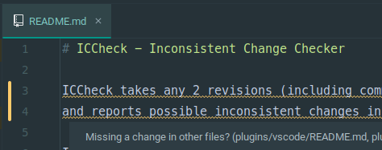
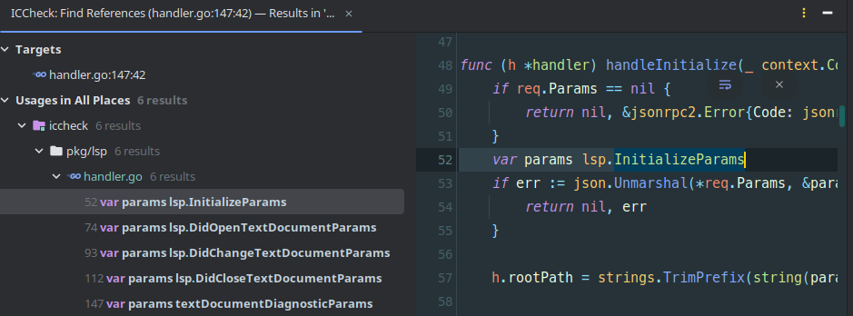

# ICCheck - Inconsistent Change Checker

ICCheck finds inconsistent changes in your copy-pasted codes!

ICCheck takes any 2 revisions in a Git repository, and reports possible inconsistent changes.
Compare between HEAD and worktree for pre-commit changes, or between main and your feature branch
to run last-second checks on Pull Requests.

Please note that the way of detecting copy-pasted codes (i.e. cloned codes) is heuristic,
and therefore is not perfect.
While ICCheck detects many cloned codes correctly, it may also detect many false-positives.

## Installation

### Command Line Interface (statically-linked binary)

- Download from the [latest releases](https://github.com/salab/iccheck/releases) page.
- Or, build it from source: `go install github.com/salab/iccheck@latest`

### GitHub Actions

See "GitHub Actions Usage" section below.

### Editor Extensions

ICCheck utilizes [LSP (Language Server Protocol)](https://microsoft.github.io/language-server-protocol/) to support multiple editors.



Currently, the following extensions are available from the authors:

- VSCode: [iccheck - Visual Studio Marketplace](https://marketplace.visualstudio.com/items?itemName=motoki317.iccheck)
- IntelliJ IDEA Ultimate: [ICCheck - Inconsistency Check - IntelliJ IDEs Plugin | Marketplace](https://plugins.jetbrains.com/plugin/24779-iccheck--inconsistency-check)

If your editor is LSP-compatible, download the binary and run `iccheck lsp` command to launch the Language Server.

## CLI Usage

Quick start: Run ICCheck in a git repository, with some local changes.

```plaintext
$ iccheck
2024/11/26 22:43:13 INFO 22 change chunk(s) within 3 file(s) found. from="HEAD (d46bf7e87fb62877f0052534659589ecc4c8aa41)" to=WORKTREE
2024/11/26 22:43:13 INFO 5 clone(s) are likely missing consistent change.

Clone set #0 - 5 out of 6 clones are likely missing consistent change(s).
  Missing changes (5):
    pkg/lsp/handler.go:74 (L74-L74)
    pkg/lsp/handler.go:93 (L93-L93)
    pkg/lsp/handler.go:112 (L112-L112)
    pkg/lsp/handler.go:147 (L147-L147)
    pkg/lsp/handler.go:52 (L52-L52)
  Changed clones (1):
    pkg/lsp/handler.go:167 (L167-L167)
```

ICCheck has found changes between HEAD commit and the worktree, and found that you are possibly
missing changes to the reported locations.

### CLI Flags

Running `iccheck --help` displays help message.

```text
Finds inconsistent changes in your git changes.

Usage:
  iccheck [flags]
  iccheck [command]

Available Commands:
  help        Help about any command
  lsp         Starts ICCheck Language Server
  search      A low-level command to search for code clones

Flags:
      --algorithm string              Clone search algorithm to use (fleccs, ncdsearch) (default "fleccs")
      --algorithm-param stringArray   (Advanced) Parameters of the algorithm, consult code for syntax.
      --disable-default-ignore        Disable default ignore configs
      --fail-code int                 Exit code if it detects any inconsistent changes
      --format string                 Format type (console, json, github) (default "console")
  -f, --from string                   Base git ref to compare against. Usually earlier in time.
  -h, --help                          help for iccheck
      --ignore stringArray            Regexp of file paths (and its contents) to ignore.
                                      If specifying both file paths and contents ignore regexp, split them by ':'.
                                      Example (ignore dist directory): --ignore '^dist/'
                                      Example (ignore import statements in js files): --ignore '\.m?[jt]s$:^import'
      --log-level string              Log level (debug, info, warn, error)
      --micro                         Splits query to detect micro-clones (has performance implications!)
  -r, --repo string                   Source git directory (supports bare)
      --timeout-seconds int           Timeout for detecting clones in seconds (default 60)
  -t, --to string                     Target git ref to compare from. Usually later in time.
                                      Can accept special value "WORKTREE" to specify the current worktree.
  -v, --version                       version for iccheck

Use "iccheck [command] --help" for more information about a command.
```

ICCheck also reads flag values from environment variables, prefixed by `ICCHECK_`.
For example, to set the equivalent of cli argument `--from=HEAD` from environment variable,
set `ICCHECK_FROM` environment variable to `HEAD`.
If both cli args and env vars are set, cli args are preferred.

Reading config from environment variables applies to all commands, including the LSP server.

### CLI Output Format

ICCheck outputs detected inconsistent changes to stdout, and other logging outputs to stderr.

Output format can be changed via the `--format` argument.
Make sure to check `--format json` out for ease integration with other systems such as review bots.

For example, one can utilize `jq` to process the JSON stdout into [the GitHub Actions annotation format](https://docs.github.com/en/actions/using-workflows/workflow-commands-for-github-actions#example-creating-an-annotation-for-an-error).

```shell
iccheck --format json | jq -r '":::notice file=\(.filename),line=\(.start_l),endLine=\(.end_l),title=Possible missing change::Possible missing a consistent change here (L\(.start_l) - L\(.end_l), distance \(.distance))"'
```

## GitHub Actions Usage

An example workflow file:

```yaml
name: Inconsistent Change Check

on:
  push:
    branches:
      - 'main'
  pull_request:

jobs:
  iccheck:
    name: Inconsistent Change Check
    runs-on: ubuntu-latest
    steps:
      - name: Install ICCheck
        run: |
          VERSION=$(curl -Lsf "https://api.github.com/repos/salab/iccheck/releases/latest" | jq -r '.tag_name')
          DOWNLOAD_URL="https://github.com/salab/iccheck/releases/download/$VERSION/iccheck_${VERSION//v/}_linux_amd64"
          curl -Lf "$DOWNLOAD_URL" -o iccheck
          chmod +x iccheck
          sudo install iccheck /usr/local/bin/

      - uses: actions/checkout@v4
        with:
          fetch-depth: '2'
      - name: Check for inconsistent changes
        run: iccheck --from "HEAD^" --to "HEAD" --format github
```

## Editor Extensions

Install the extension.
Then, edit any text files in a git-controlled directory.
ICCheck will automatically run when you open or edit files, and display line warnings
if you are likely missing changes to other similar lines.


You can set cursor to warnings and run 'Find References' to display all clone
locations in the clone set.
(For example, Shift+F12 in VSCode, Alt+F7 in IntelliJ)



## Ignore Definitions

ICCheck reads from the following files to determine which files and/or lines to ignore,
when calculating info / warnings.

1. `~/.config/.iccheckignore.{yaml,yml}`
2. `${repoDir}/.iccheckignore.{yaml,yml}`

The ignore definitions is a yaml array and syntax is as follows:

```yaml
# The whole file should be a yaml array, each of which is a single ignore definition rule.

# "files" (if present) specifies which file paths to ignore.
# "patterns" (if present) specifies which file contents to ignore.
# Both keys use the golang regexp syntax: RE2
# For RE2 syntax, see: https://github.com/google/re2/wiki/syntax

# A rule to ignore all files under dist/ path.
- files:
    - '^dist/'

# A rule to ignore lines which match '^import' in any file.
- patterns:
    - '^import'

# A rule to ignore specific lines in .go files.
- files:
    - '\.go$'
  patterns:
    - '^package .+$'
    - '^import (.+ )?".+"$'
    - '^import \(\n(\s+(.+ )?".+"\n)*\)$'
```

There are some built-in default rules in ICCheck.
See [pkg/domain/ignore.go](./pkg/domain/ignore.go) for the default rules.
These default rules can be disabled by the `--disable-default-ignore` CLI option.
